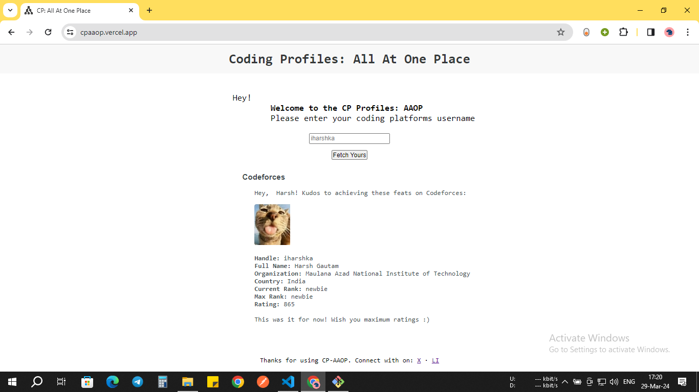
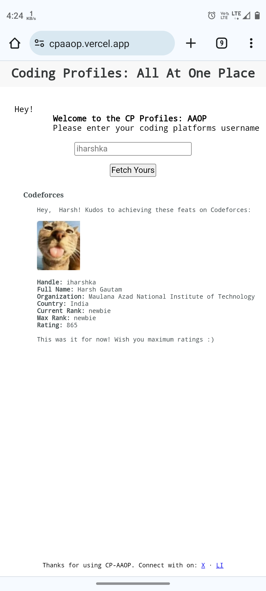

# Coding Profiles - All At One Place

CP-AAOP is a simple website that displays competitive coding profiles in one place by utilizing the APIs provided by coding platforms.

**_Desktop_**

**_Mobile_**

The UI is minimalist with a focus on functionality.

## Features

Upon entering the coding platform username, the website displays the following information about the user (currently for Codeforces only):

- Handle,
- Profile Pic,
- Full name,
- Organization,
- Country,
- Current Rating,
- Max Rank,
- Current Rank.

## Tech Stack

**Client:** HTML, CSS, JavaScript

**Tools:** Git, Vercel, Postman, Chrome Developer Tools, VS Code

**_: Fun fact_** This website uses the XMLHttpRequest method of API calls, which is the oldest ever method of API calls. It was predominantly used before the release of the ECMAScript-6 module which included the fetch() method that made things much simpler by using promises. Later open-source library, Axios, made it even simpler by automating the process of parsing the API response string to JSON.

## Lessons Learned & Future Scope

I wrote this website in around 3 hours and faced a few challenges in understanding the API structure of Codeforces and in using XMLHttpRequest which I never used earlier. For this, Stackoverflow, Codeforces developers' official documentation, and the documentation of GFG helped a lot.

_A fact:_ I wasted around 20 minutes thinking why the _null_ is getting logged when I tried to log the API response. Later I came across GFG's doc to know _xhttpr.responseText_ in XMLHttpRequest gives us the response string of the API call. This was the bottleneck after which the fingers ran fast and I completed the project in an hour.

**Future Scope**

Future scope includes maximum coding platforms support or inclusion like Leetcode, Codechef, Atcoder, etc where the user can enter their username and it will display all platforms' profiles (if exist or by the same username). The limitation of this project is that not every coding platform provides public APIs.

### References

1. https://codeforces.com/apiHelp
2. https://www.geeksforgeeks.org/what-is-xmlhttprequest-object/

_References that may help in setting up the development environment:_

1. https://docs.github.com/en/migrations/importing-source-code/using-the-command-line-to-import-source-code/adding-locally-hosted-code-to-github
2. https://learning.postman.com/docs/designing-and-developing-your-api/testing-an-api/
3. https://vercel.com/docs/deployments/overview

## 🚀 About Me

I'm Harsh, a problem solver, frontend developer & DevOps Eg, soon to be on the backend and new techs (#Web3? adaptive, you say). I want to work on a problem statement where I can cater to hundreds of thousands or millions of people or the one that keeps me staying up all night. Thank you for showing interest in this project. Never mind connecting with me on socials. See you soon.

